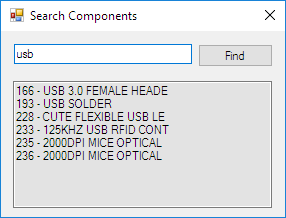

# Locatronics
 - C#.net application
 - Find out where your tiny electronics components are located at.

## Inspirations
 - [How to Store and Organise Electronic Parts](https://youtu.be/BSGmdM2NbQk)
 - [Organize Resistors, Inductors, and Capacitors](https://youtu.be/Aqd2HNG5IQY)
 - [Space Saving Organiser for Small Components](https://youtu.be/FJgynvN0D0w)

## General working
 - Creates a local searchable database of your organizer bins and their placements within your racks.
 - Can be used for anything where you need to search.

## Info
 - It is a standalone application.
 - Contains self hosted database (as variables).
 - The software does not need any electronics, wiring and Arduino at the moment.
 - You can still DIY Electronics and wire the LEDs based on the output of the search results.
 - To view [locatronics.bmpr](locatronics.bmpr), install [Balsamiq Wireframes](https://balsamiq.com/wireframes/desktop/).

## Output

